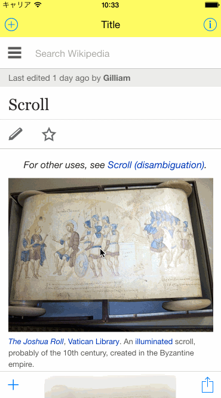
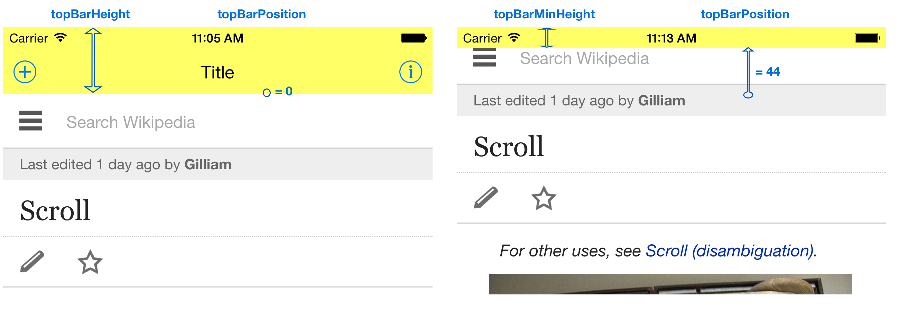

# Introduction
[](http://cocoadocs.org/docsets/ScrollingBars)
[](http://cocoadocs.org/docsets/ScrollingBars)
[](http://cocoadocs.org/docsets/ScrollingBars)
[](https://travis-ci.org/taisukeh/ScrollingBars)
[](https://github.com/igrigorik/ga-beacon)

## What is it?

`ScrollingBars` make top and bottom bars follow scrollilng of a UIScrollView or similar view (e.g. UITableView or UIWebView). It works like the Safari app for iOS8.

`ScrollingBars` **can't use with UINavigationController's navigation bar**
because the navigation bar provides no way to change it's height or
position. It is recommended to create top bar as a generic UIView.

## So what can I do with it?



# Installation

Add the following to your `Podfile` and run `$ pod install`.

``` ruby
pod 'ScrollingBars'
```

If you don't have CocoaPods installed or integrated into your project, you can learn how to do so [here](http://cocoapods.org).

# Example

`ScrollingBarsExample.xcworkspace` in the `ScrollingBarsExample` directory serves as an example implementation of `ScrollingBars`. 

# Usage


Import ScrollingBars module.

```
import ScrollingBars
```


Define your view controller class with ScrollingBarsDelegate.

```
class YourViewController: UIViewController, ScrollingBarsDelegate {
```

Create outlet connections.

```
    @IBOutlet weak var topBar: UIView!
    @IBOutlet weak var bottomBar: UIToolbar!

    @IBOutlet weak var topBarTopSpaceConstraint: NSLayoutConstraint!
    @IBOutlet weak var bottomBarBottomSpaceConstraint: NSLayoutConstraint!
```

Define ScrollingBarsDelegate methods.

```
    // MARK: - ScrollingBarsDelegate
    
    var topBarHeight: CGFloat {
        return self.topBar.frame.size.height
    }
    
    var topBarMinHeight: CGFloat {
        if UIApplication.sharedApplication().statusBarFrame.size.height > 20  {
            // In-Call statusbar
            return 0
        } else {
            return UIApplication.sharedApplication().statusBarFrame.size.height
        }
    }

    var topBarPosition: CGFloat {
        get {
            return -self.topBarTopSpaceConstraint.constant
        }
        set {
            self.topBarTopSpaceConstraint.constant = -newValue
            // layout for animation
            self.topBar.layoutIfNeeded()
        }
    }

    var bottomBarHeight: CGFloat {
        return self.bottomBar.frame.size.height
    }
    
    var bottomBarPosition: CGFloat {
        get {
            return -self.bottomBarBottomSpaceConstraint.constant
        }
        set {
            self.bottomBarBottomSpaceConstraint.constant = -newValue
            // layout for animation
            self.bottomBar.layoutIfNeeded()
        }
    }

    var bottomBarMinHeight: CGFloat {
        return 0
    }
```
For the return values of theese delegate methods, see the below picture.



Call `ScrollingBars`'s `follow` method in viewDidLoad (or other appropriate place), and set `ScrollingBar` instance to UIScrollView delegate.

```
    scrollingBars.follow(self.scrollView, delegate: self)
    self.scrollView.delegate = scrollingBars

    // In addition, you may need to set this.
    self.automaticallyAdjustsScrollViewInsets = false
```

If you can't overwrite UIScrollView delegate, pass proxy UIScrollView delegate methods manually like follows.
```
   func scrollViewWillBeginDragging(scrollView: UIScrollView) {
        scrollingBars.scrollViewWillBeginDragging(scrollView)
   }

    func scrollViewDidEndDragging(scrollView: UIScrollView, willDecelerate decelerate: Bool) {
        scrollingBars.scrollViewDidEndDragging(scrollView, willDecelerate: decelerate)
    }

    func scrollViewDidScroll(scrollView: UIScrollView) {
        scrollingBars.scrollViewDidScroll(scrollView)
    }

    func scrollViewWillBeginDecelerating(scrollView: UIScrollView) {
        scrollingBars.scrollViewWillBeginDecelerating(scrollView)
    }

    func scrollViewShouldScrollToTop(scrollView: UIScrollView) -> Bool {
        return scrollingBars.scrollViewShouldScrollToTop(scrollView)
    }
```


If your view will rotate, you should probabily change the top bar height.

```
    override func viewWillTransitionToSize(size: CGSize, withTransitionCoordinator coordinator: UIViewControllerTransitionCoordinator) {
        coordinator.animateAlongsideTransition({ (context : UIViewControllerTransitionCoordinatorContext!) -> Void in
            self.updateTopBarHeight()
            }, completion: nil)
    }

    func updateTopBarHeight() {
        let orientation = UIApplication.sharedApplication().statusBarOrientation
        var height: CGFloat
        if orientation.isPortrait || UIDevice.currentDevice().userInterfaceIdiom == .Pad {
            height = 64
        } else {
            height = 44
        }

        let isHeightChanged = self.topBarHeightConstraint.constant != height
        if isHeightChanged {
            self.topBarHeightConstraint.constant = height
            self.topBar.layoutIfNeeded()
            self.scrollingBars.refresh(animated: false)
        }
    }
```

# Requirements

Requires iOS 7.0, Swift.

# Contributing

Forks, patches and other feedback are welcome.

test
